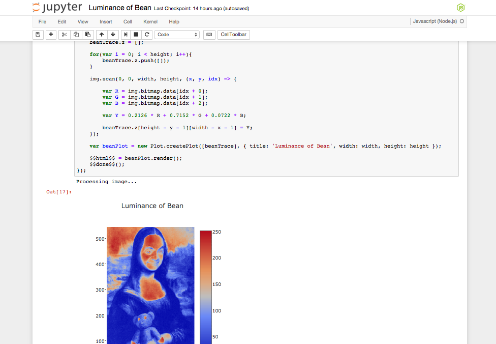

# Plotly Notebook

A small package for using Plotly.js plots in Jupyter and Tonicdev notebooks. Still
very much in beta!



## Jupyter Usage

Using plotly with Jupyter requires installing the
[IJavascript](https://github.com/n-riesco/ijavascript) kernel for Jupyter, then
requiring the `plotly-notebook-js` code. You will need to be using a notebook
running from the same directory as where `plotly-notebook-js` is installed.

```shell
$ npm install plotly-notebook-js
$ jupyter notebook
```

Then in your new node notebook:

```javascript
var Plot = require('plotly-notebook-js');

var myPlot = Plot.createPlot([{ x: [1,2,3], y: [3,4,5] }], { title: 'Plotly in Jupyter!' });

$$html$$ = myPlot.render();
```

Using the IJavascript kernel, `$$html$$` is a global variable that will output
html.

Additionally, all of the methods except `render` are chainable, so you can write:

```javascript
$$html$$ = myPlot.addTraces([{ x: [1,2,3], y: [4,5,6]}, { x: [1,2,3], y: [6,5,3] }])
  .restyle({ marker: { color: 'red' }}, 1)
  .render();
```

## Tonicdev Usage

In Tonicdev, there is no global output variable like with Jupyter - it intelligently
displays html when it is the output.

```javascript
var Plot = require('plotly-notebook-js');

var myPlot = Plot.createPlot([{ x: [1,2,3], y: [3,4,5] }], { title: 'Plotly in Tonicdev!' });

myPlot.render();
```

## Design

The interface closely resembles that of
[plotly.js](https://plot.ly/javascript/plotlyjs-function-reference/), but with
some small (yet intuitive!) changes - most notably, you don't need to provide
a dom element to the function calls.

Additionally, you may operate on the returned object!

```javascript
var myPlot = Plot.createPlot([
  { x: [1,2,3], y: [20,30,40] },
  { x: [1,2,3], y: [10,50,20] },
  { x: [1,2,3], y: [30,10,30] }
  ], {});

// Remove the first trace from `data`
myPlot.data.splice(0, 1);

myPlot.restyle({ marker: { color: 'red' }}, [1])
  .render();
```

This will change the marker color on the second element of your data
object. Because all the methods (except render) return a plot object, you can
chain your calls together!

## Reference

All instance methods except `render` return the plot object, so calls can be chained
together, and `plot.data` and `plot.layout` may be operated on directly.

#### `Plot.createPlot(data, layout, cdn)`

| Params   | Description                                                                      |
|----------|----------------------------------------------------------------------------------|
| `data`   | (Optional) An array of objects containing trace data                             |
| `layout` | (Optional) A layout object                                                       |
| `cdn`    | (Optional) A boolean value whether to use the plotly.js cdn. Defaults to `false` |

Returns a plot instance with the properties `data`, `layout` and `scriptSource`.
All of these may be mutated, and their effects seen when next `render`ed.

#### `Plot#render()`

Outputs the raw html required for notebooks to create and display a plot.
The plots will be contained in `div`'s with an id of `notebook-plot-TIMESTAMP`.

#### `Plot#addTraces(traces, [indices])`

| Params    | Description                                                                  |
|-----------|------------------------------------------------------------------------------|
| `traces`  | Either a single trace object, or an array of trace objects                   |
| `indices` | (Optional) An array of indices where corresponding traces should be inserted |

Adds traces to either the end of `plot.data` or to the specified corresponding
indices. If arrays are used, the length of `traces` and `indices` must be the same.

#### `Plot#deleteTraces(indices)`

| Params    | Description                                                                |
|-----------|----------------------------------------------------------------------------|
| `indices` | An index, or array of indices where corresponding traces should be removed |

Deletes traces from `plot.data` as specified. You can also use negative indices
to remove traces from the end of the traces array.

#### `Plot#restyle(update, indices)`

| Params    | Description                                                                 |
|-----------|-----------------------------------------------------------------------------|
| `update`  | An object with the fields to be modified                                    |
| `indices` | (Optional) An array of indices where corresponding traces should be updated |

Updates traces with data as specified in the `update` parameter. The indices are
optional and if excluded, the update will be applied to all traces.

## Roadmap

* Adding more methods to match the plotly.js api
* Adding the ability to save plots to the plotly cloud
